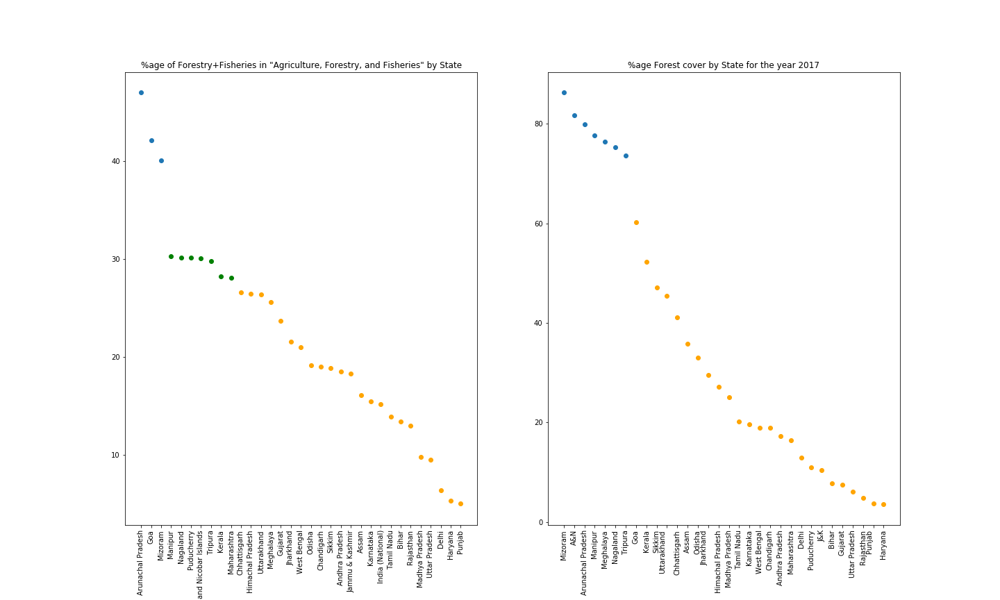

# Introducing the Topic
- Studies have shown the importance of Forest Products to the local economy, in terms of impact on individual households.[^need]
- However, the total contribution of forests to the national GDP is very low.[^fao] 
- Has the dependence on forest produce decreased? Are there localised blobs with greater reliance on such?

# What is Analysed
- The contribution of Forest products to the overall GDP of the nation.
- The localised impact of Forests on specific States.
- Possible correlation between forest cover and reliance on its.

Time frame: Post-independence India, 1951-2014

# Data Sources
- http://planningcommission.gov.in/data/datatable/ 0814/table_66.pdf
- http://statisticstimes.com/economy/sectorwise-gdp-contribution-of-india.php
- http://planningcommission.gov.in/data/datatable/ data_2312/DatabookDec2014%202.pdf 
- http://www.fsi.nic.in/forest-report-2017

# The contribution of Forest products to the overall GDP of the nation

## Methods
- We take data released by the Planning Commission[^sectorwise] and graph the changes in multiple sectors.
- Since exact Forestry data was not directly found for much of the date range, (it is classified under "Agriculture, forestry, and fishing") we estimate the breakdown by extrapolation, and graph that as well.

# The contribution of Forest products to the overall GDP of the nation (Cont.)

# The localised impact of Forests on Specific States

## Measuring the Impact
Barik, S. K., and S. K. Mishra[^nepaper] studied the contribution of forests to the economy of the northeastern States of India

- They refer to the lack of immediately available data and the needs for estimates to understand how much of the GDP forests actually contribute to 
- As such, the only direct data they have available is on Meghalaya

Since we lack data, to see specific States that may depend on Forest produce more we use another indirect method

# The localised impact of Forests on Specific States (Cont.)

## Methods (1)
Economic Data by Sector provided by the government[^neforest] classifies Agriculture, Forestry, and Fisheries under one heading.

Alongside, agricultural data is separately specified, making the difference the contribution of Forestry + Fisheries.

For Inland States, we can assume that the contribution of Fisheries is not as prominent as the Forestry, and for otherwise we can estimate equal contribution. This can be further updated with the method from the next slide.

# The localised impact of Forests on Specific States (Cont.)

## Methods (2)
The reliance of a local (or state-level) economy to forestry should be correlated with the forest cover of the area[^forestcover]. 

# The localised impact of Forests on Specific States (Cont.)

# The localised impact of Forests on Specific States (Cont.)

## Observations

- In Graph 1, 3 States are prominently less reliant on agriculture as compared to others, 2 of these are North-Eastern.
- Among the somewhat-less-reliant-on-agriculture States, on removing the coastal ones we get 5 of 8 North-Eastern States.
- In Graph 2, 7 States have a prominently higher forest coverage than the rest, of which 6 are North-Eastern.
- Meghalaya is the only State with very high forest coverage but little non-agricultural produce[^nepaper].

# References

[^fao]: http://www.fao.org/forestry/country/57478/en/ind/
[^need]: Hegde, Ravi, and T. Enters. "Forest products and household economy: a case study from Mudumalai Wildlife Sanctuary, Southern India." Environmental conservation 27.3 (2000): 250-259.
[^sectorwise]: http://planningcommission.gov.in/data/datatable/data_2312/DatabookDec2014% 202.pdf
[^sectorgrowth]: http://statisticstimes.com/economy/sectorwise-gdp-growth-of-india.php
[^nepaper]: Barik, S. K., and S. K. Mishra. "Assessment of the contribution of forests to the economy of the northeastern states of India." International Forestry Review 10.2 (2008): 349-361.
[^neforest]: http://planningcommission.gov.in/data/datatable/0814/table_66.pdf
[^forestcover]: http://www.fsi.nic.in/forest-report-2017

- [Sector-wise contribution of GDP of India: link](http://planningcommission.gov.in/data/datatable/data_2312/DatabookDec2014%202.pdf)
- [Sector-wise growth of GDP of India: link](http://statisticstimes.com/economy/sectorwise-gdp-growth-of-india.php)
- Malik, D. P., and Sunil Dhanda. "Status, trends and demand for forest products in India." Fuel 241.2.68 (2003): 1-81.
- Barik, S. K., and S. K. Mishra. "Assessment of the contribution of forests to the economy of the northeastern states of India." International Forestry Review 10.2 (2008): 349-361.
- http://planningcommission.gov.in/data/datatable/0814/table_66.pdf
