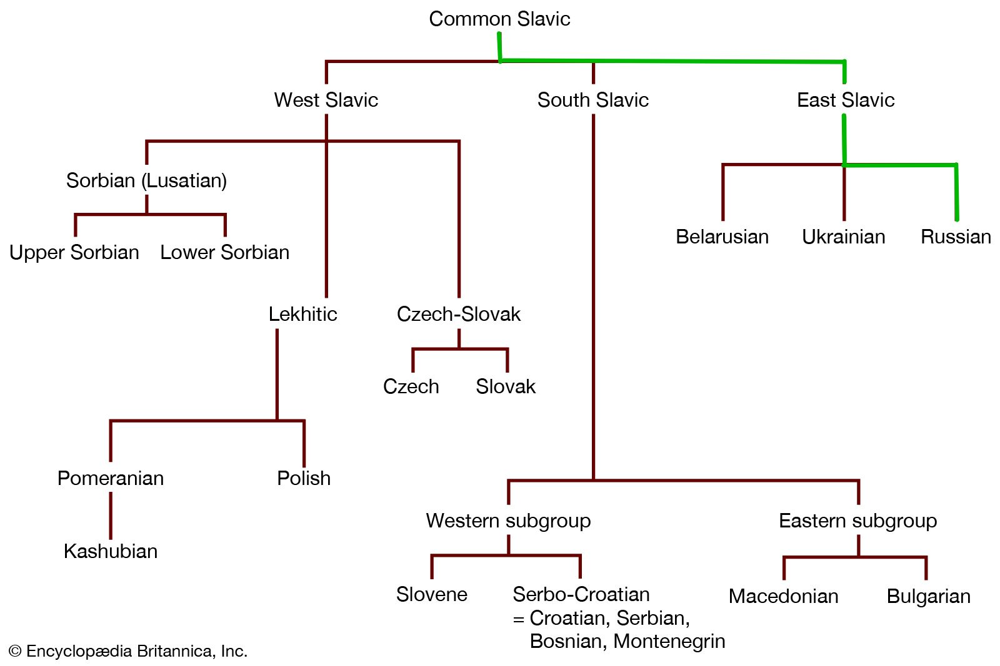
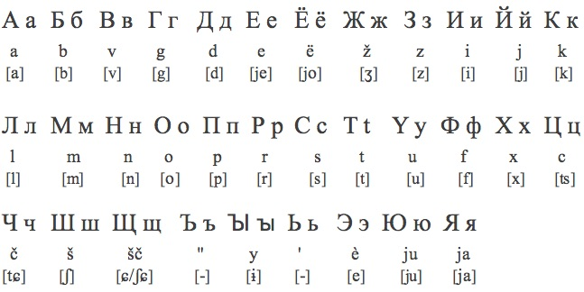

# Introduction and Language Family

- Indo-European Language 
    - One of four living East Slavic languages.
    - Cyrillic Script
- 160 million native speakers

# Introduction and Language Family

# Introduction and Language Family

## Important Features of the Language

- Widespread palatalization of consonants (Also in other Slavic Languages)
- Extensive nominal morphology
- Simple verb system

# Orthography

- Russian uses the Cyrillic alphabet (русский -	[ˈruskʲɪj jɪˈzɨk])
- There are 32 letters, and an *additional sign for palatalization*
    - Ь indicates palatalization of the previous consonant.
    - Ъ is silent; it prevents palatalization of the preceding consonant.

# Orthography

# Phonology and Phonetics - Vowels

- 5 vowels or 6?
- Phonemic status of the i/ɨ alternation: 
    - ɨ occurs only after non-palatalized consonants
    - i only after palatalized ones and word-initially
    - They could be considered complementary sounds and not separate phonemes.
- The reduced i and u vowels of the ancestral Slavic language were lost in Russian.

# Phonology and Phonetics - Vowels

            **Front**       **Central**     **Back**
---         ----------      -----------     ----------
**Mid**      i               (ɨ)             u
**Mid**      e                               o
**Low**                       a               

Table: Vowel Chart in Russian

# Phonology and Phonetics - Consonants

- There are 36 consonants.
- Consonant palatalization is widespread
    - **[ts]**, **[ʃ]**, **[ʒ]** lack palatalized counterparts.
    - **[tɕ]**, **[ɕ]**, **[j]**, are always palatalized, lacking counterparts.
- Palatalization is represented by an accent mark over the letter.

# Phonology and Phonetics - Consonants

|               |             | **Labial** | **Dental** | **Alveopalatal** | **Palatal** | **Velar** |
|---------------|-------------|------------|------------|------------------|-------------|-----------|
| **Stop**      | Voiceless   | p ṕ        | t t'       |                  |             | k ḱ       |
|               | Voiced      | b b'       | d d'       |                  |             | g ǵ       |
| **Affricate** | *Voiceless* |            | ts         |                  | tɕ          |           |
| **Fricative** | *Voiceless* | f f'       | s ś        | ʃ                | ɕ           | x x'      |
|               | *Voiced*    | v v'       | z ź        | ʒ                |             |           |
| **Nasal**     |             | m ḿ        | n ń        |                  |             |           |
| **Liquid**    |             |            | r ŕ l ĺ    |                  |             |           |
| **Glide**     |             |            |            |                  | j           |           |

Table: Consonant chart

# Phonology and Phonetics - Stress
Stress can fall on any syllable and it may serve to differentiate lexical or morphological forms. For instance, muká (‘flour’) versus múka (‘torment’), rukí (genitive singular) versus rúki (nominative plural).

# Morphology

# Person, Gender, and Number

# Tense

# Modality

# Adjectives

# Nouns

# Pronouns

# Syntax and Semantics

# Numbers 

# Colours

# Kinship terms

# Cultural Significance

