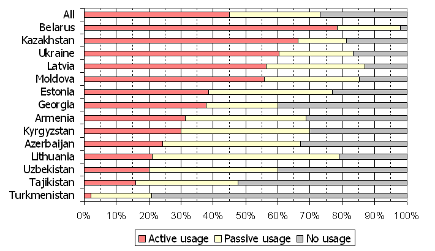

# Introduction and Language Family

- **Indo-European** Language 
    - One of four living East Slavic languages
    - Cyrillic Script
- 160 million native speakers
- USSR influence in popularity

# Introduction and Language Family

# Introduction and Language Family

# Introduction and Language Family

## Important Features of the Language

- Widespread palatalization of consonants (Also present in other Slavic Languages)
- Extensive nominal morphology
- Simple verb system

# Orthography

- Russian uses the **Cyrillic alphabet** (русский -	[ˈruskʲɪj])
- There are 32 letters and an *additional sign for palatalization* [^33]
    - Ь indicates palatalization of the previous consonant.
    - Ъ is silent; it prevents palatalization of the preceding consonant.
- Stress is not normally indicated orthographically. An optional acute accent is used to mark it when distinguishing between homographic words.

[^33]: This is sometimes reported as 33 letters. I have kept the 'additional sign for palatalization'

# Orthography

# Phonology and Phonetics - Vowels

- 5 vowels or 6?
- Phonemic status of the i/ɨ alternation: 
    - ɨ occurs only after non-palatalized consonants
    - i only after palatalized ones and word-initially
    - They could be considered complementary sounds and not separate phonemes.
- The reduced i and u vowels of the ancestral Slavic language were lost in Russian.

# Phonology and Phonetics - Vowels

            **Front**       **Central**     **Back**
---         ----------      -----------     ----------
**Mid**      i               (ɨ)             u
**Mid**      e                               o
**Low**                       a               

Table: Vowel Chart in Russian

# Phonology and Phonetics - Vowels
{ width=60% }

# Phonology and Phonetics - Consonants

- There are 36 consonants.
- Consonant palatalization is widespread
    - **[ts]**, **[ʃ]**, **[ʒ]** lack palatalized counterparts.
    - **[tɕ]**, **[ɕ]**, **[j]**, are always palatalized, lacking counterparts.
- Palatalization is represented by an accent mark over the letter.

# Phonology and Phonetics - Consonants

|                 |             | **Labial** | **Dental** | **Alveopalatal** | **Palatal** | **Velar** |
|-----------------|-------------|------------|------------|------------------|-------------|-----------|
| **Stop**        | Voiceless   | p ṕ        | t t'       |                  |             | k ḱ       |
|                 | Voiced      | b b'       | d d'       |                  |             | g ǵ       |
| **Affricate**   | *Voiceless* |            | ts         |                  | tɕ          |           |
| **Fricative**   | *Voiceless* | f f'       | s ś        | ʃ                | ɕ           | x x'      |
|                 | *Voiced*    | v v'       | z ź        | ʒ                |             |           |
| **Nasal**       |             | m ḿ        | n ń        |                  |             |           |
| **Trill**       |             |            | l ĺ        |                  |             |           |
| **Approximant** |             |            | r ŕ        |                  | j           |           |

Table: Consonant chart

# Phonology and Phonetics - Stress
Stress can fall on any syllable and it may serve to differentiate lexical or morphological forms. For instance, muká (‘flour’) versus múka (‘torment’), rukí (genitive singular) versus rúki (nominative plural).

Stress is not normally indicated orthographically. An optional acute accent is used to mark it when distinguishing between homographic words.

# Phonology and Phonetics - Syllable Structure 

Syllable structure can be complicated, wih inital and final consonant clusters of upto 4 consecutive sounds: **CCCCVCCCC**

These clusters are not very common. Examples: 
- взгляд ([vzglʲat], 'glance') 
- государств ([gəsʊˈdarstf], 'of the states')

Syllables cannot span multiple morphemes.

# Morphology

Russian Morphology is **highly fusional**

# Morphology - Nouns

Russian nominal morphology has retained part of the complexity of Old Church Slavonic:

- It has lost the vocative case
- The number of declension types has been reduced
- The dual number has disappeared

Definite and Indefinite Articles do not exist

# Morphology - Nouns

| **Property**   | **Values**                                                                     |
|----------------|--------------------------------------------------------------------------------|
| **Gender**     | masculine, neuter, feminine                                                    |
| **Number**     | singular, plural                                                               |
| **Case**       | nominative, accusative, genitive, dative, instrumental, locative/prepositional |
| **Adjectives** | masculine singular, neuter singular, feminine singular, plural                 |
| **Pronouns**   | personal, possessive, demonstrative, interrogative, relative                   |

Table: General characteristics covered under Nominal Morphology

# Morphology - Nouns and Case 

Russian noun cases may supplant the use of prepositions entirely. Furthermore, every preposition is exclusively used with a particular case (or cases).

# Morphology - Nouns and Case 

Russian has four major types of noun declension: a-stem, masculine o-stem, neuter o-stem and i-stem.

- Most a-stem nouns are feminine (but those that refer to a male are masculine).
- Almost all i-stems are feminine.
- O-stem nouns are masculine or neuter.

# Morphology - Nouns and Adjectives

- Plural forms do not distinguish gender
- Neuter and Masculine adjectives differ in nominative and accusative 
- Feminine sing. adjectives: one form for genitive, dative, instrumental, locative 

# Morphology - Nouns and Animacy

# Morphology - Nouns and Animacy

# Morphology - Nouns and Animacy

 **Animacy** is relevant in nominal and adjectival declensions.
- The Accusative has two possible forms depending on animacy of the referent
- For Animate referents (persons, animals), accusative is generally identical to genitive
- For Inanimate referents, accusative is identical to nominative 

# Morphology

# Morphology - Verbal

Far simpler than Nominal Morphology

The infinitive is the only non-finite form widely used.

| **Property**          | **Values**                                       |
|-----------------------|--------------------------------------------------|
| **Person and Number** | 1s, 2s, 3s; 1p, 2p, 3p                           |
| **Modality**          | indicative, imperative                           |
| **Tense**             | past, non-past, imperfective future, conditional |
| **Aspect**            | imperfective, perfective                         |
| **Voice**             | active, passive (infrequent)                     |

Table: General characteristics covered under Verbal Morphology

# Morphology - Verbal, Tense

# Morphology - Verbal

# Morphology - Verbal

# Morphology

# Morphology

# Syntax

Very flexible SVO

# Syntax

Case system is enouh to indicate function of words in sentences

# Syntax

Prepositions, rather than postpositions

Subordinate clauses follow main clauses

Adjectives precede nouns, agree in gender, number, case.

# Syntax

No articles

Copula ('to be' verb) is omitted in the present tense

# Syntax

Finite verbs agree with their subjects in:

- Person and number in non past tense
- Gender and number in past tense

# Semantics

# Numbers 

# Colours

# Kinship terms

# Cultural Significance

