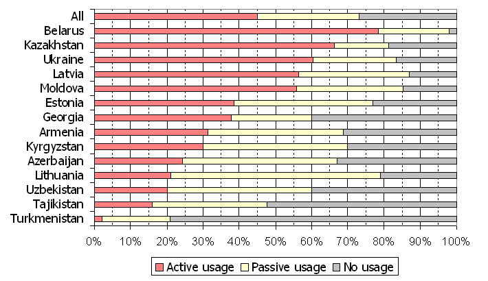
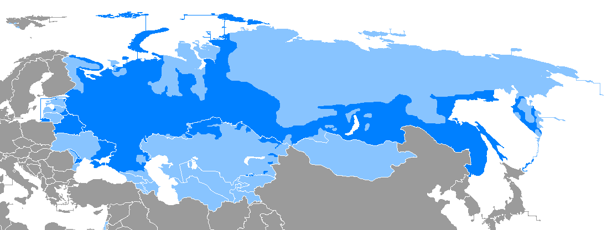
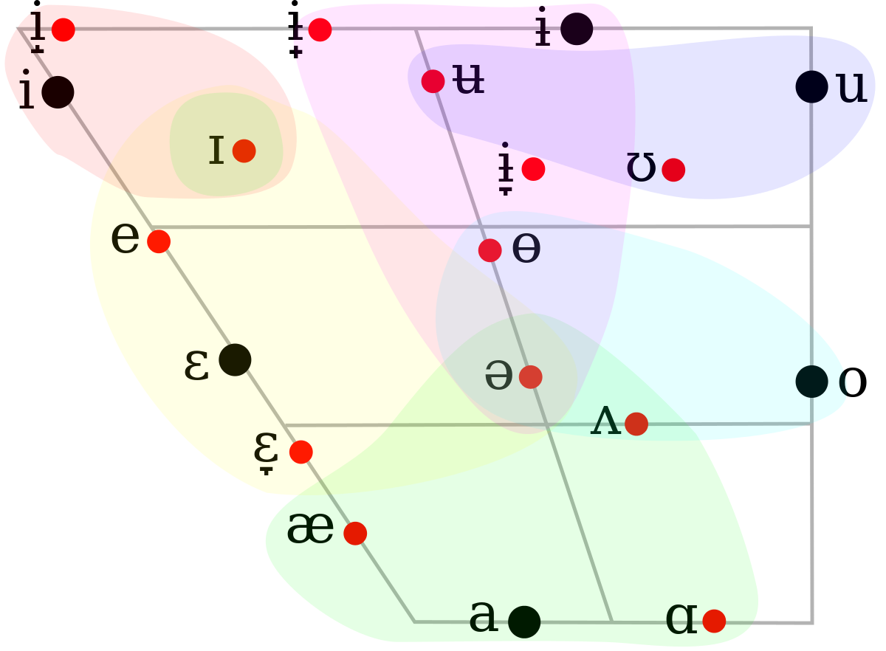
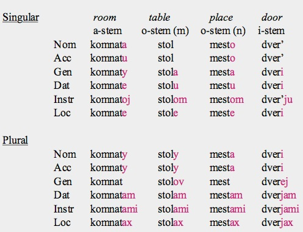
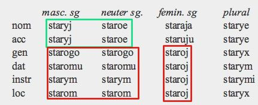
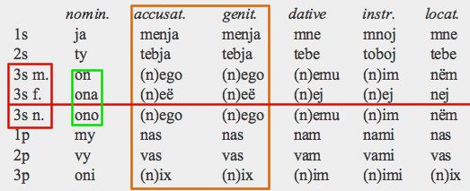
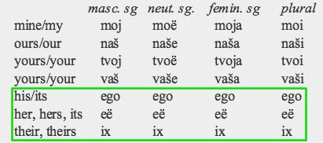
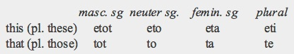
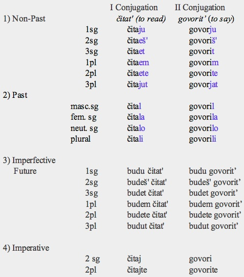

# Introduction and Language Family

Russian is an **Indo-European** language - one of the four living `East-Slavic` languages, which is a subset of the `Common Slavic` languages. 

With over 160 million native speakers, it is the 8th most natively-spoken language in the world, and also the most geographically widespread language in Eurasia. Native speakers of Russian include not only the Russian people, but also people from several countries belonging to erstwhile USSR. Among these, it is an official language in the Russian Federation, Belarus, Kazakhstan and Kyrgyzstan. 

## Important Features of the Language

Amongst other important features of the language, some of the more prominent ones are:

- Widespread palatalization of consonants. This is also present in other Slavic Languages.
- There is extensive nominal morphology, a holdover from the complexity of old Indo-European languages. It is most notable in its declension system
- The verb system is simpler, with only two basic verbs.

## Dialects of Russian

There are three notable dialects of Russian that can be distinguished by their pronunciation:

- **The Nothern Dialect**, spoken from St. Petersburg eastwards across Siberia
- **The Souther Dialect**, spoken in most of Central and Southern Russia
- **The Central Dialect**, in between the two above. 

# Orthography

Russian uses the **Cyrillic alphabet** ('Russian' is written русский -	[ˈruskʲɪj] in Cyrillic). It is derived from a script created between 800-900 AD, based on the Greek uncial script. 

- There are 32 letters and an *additional sign for palatalization* [^33]
    - Ь indicates palatalization of the previous consonant.
    - Ъ is silent; it prevents palatalization of the preceding consonant.
- Stress is not normally indicated orthographically. An optional acute accent is used to mark it when distinguishing between homographic words.

[^33]: This is sometimes reported as 33 letters. I have kept the 'additional sign for palatalization'

# Phonology and Phonetics

## Vowels

Russian has a surprisingly low number of vowel sounds, at 5 - or 6, if you subscribe to the St. Petersburg Phonological School. This confusion arises from the phonemic status of the i/ɨ alternation: 

- ɨ occurs only after non-palatalized consonants
- i only after palatalized ones and word-initially

They could be considered either complementary sounds or separate phonemes.

The reduced i and u vowels of the ancestral Slavic language were lost in Russian.

            **Front**       **Central**     **Back**
---         ----------      -----------     ----------
**Mid**      i               (ɨ)             u
**Mid**      e                               o
**Low**                       a               

Table: Vowel Chart in Russian

{ width=60% }

## Consonants

Russian has 36 consonants. Consonant palatalization is widespread, as mentioned earlier: only three consonants lack palatalized counterparts:

- **[ts]**, **[ʃ]**, **[ʒ]** lack palatalized counterparts.
- **[tɕ]**, **[ɕ]**, **[j]**, are always palatalized, lacking counterparts.

Palatalization is represented by an accent mark over the letter.

|                 |             | **Labial** | **Dental** | **Alveopalatal** | **Palatal** | **Velar** |
|-----------------|-------------|------------|------------|------------------|-------------|-----------|
| **Stop**        | Voiceless   | p ṕ        | t t'       |                  |             | k ḱ       |
|                 | Voiced      | b b'       | d d'       |                  |             | g ǵ       |
| **Affricate**   | *Voiceless* |            | ts         |                  | tɕ          |           |
| **Fricative**   | *Voiceless* | f f'       | s ś        | ʃ                | ɕ           | x x'      |
|                 | *Voiced*    | v v'       | z ź        | ʒ                |             |           |
| **Nasal**       |             | m ḿ        | n ń        |                  |             |           |
| **Trill**       |             |            | l ĺ        |                  |             |           |
| **Approximant** |             |            | r ŕ        |                  | j           |           |

Table: Consonant chart

## Stress
Stress can fall on any syllable and it may serve to differentiate lexical or morphological forms. For instance, muká (‘flour’) versus múka (‘torment’), rukí (genitive singular) versus rúki (nominative plural).

Stress is not normally indicated orthographically. An optional acute accent is used to mark it when distinguishing between homographic words.

## Syllable Structure 

Syllable structure can be complicated, wih inital and final consonant clusters of upto 4 consecutive sounds: **(C)(C)(C)(C)V(C)(C)(C)(C)** is the maximal structure of the russian syllable.

These clusters are not very common. Examples: 
- взгляд ([vzglʲat], 'glance') 
- государств ([gəsʊˈdarstf], 'of the states')

However, syllables cannot span multiple morphemes.

# Morphology

Russian Morphology is **highly fusional**

## Nouns

Russian nominal morphology has retained part of the complexity of Old Church Slavonic.

However, it has lost:

- The vocative case
- The number of declension types has been reduced
- The dual number has disappeared

Definite and Indefinite Articles do not exist in the language.

| **Property**   | **Values**                                                                     |
|----------------|--------------------------------------------------------------------------------|
| **Gender**     | masculine, neuter, feminine                                                    |
| **Number**     | singular, plural                                                               |
| **Case**       | nominative, accusative, genitive, dative, instrumental, locative/prepositional |
| **Adjectives** | masculine singular, neuter singular, feminine singular, plural                 |
| **Pronouns**   | personal, possessive, demonstrative, interrogative, relative                   |

Table: General characteristics covered under Nominal Morphology

## Nouns and Case 

Russian declensions involve 6 cases, although linguistics textbooks have identified up to 10. Most of the extras, incomplete, have fallen out of use over time. All 6 cases - nominative, genitive, dative, accusative, instrumental, and prepositional - are in two numbers, and obey absolutely the grammatical genders of masculine, feminine, and neuter.

Russian noun cases may supplant the use of prepositions entirely. Moreover, every preposition is exclusively used with a particular case (or cases).

Some examples of use are:

| **Case**      | **Use**                                                                                       |
|---------------|-----------------------------------------------------------------------------------------------|
| nominative    | main subject; default outside sentences; prepositions                                         |
| accusative    | direct object; time expressions; prepositions indicating motion                               |
| genitive      | possession; numerals; verbs; adjectives; other time expressions                               |
| dative        | indirect object; some other time expressions; impersonal clauses, age statements, auxillaries |
| instrumental  | durational time expressions; secondary direct objects                                         |
| prepositional | prepositions of a place                                                                       |

Table: Russian case usage

Russian has four major types of noun declension: a-stem, masculine o-stem, neuter o-stem and i-stem.

- Most a-stem nouns are feminine (but those that refer to a male are masculine).
- Almost all i-stems are feminine.
- O-stem nouns are masculine or neuter.

## Nouns and Adjectives

Nouns and adjectives in Russian are rather straightforward:

- Plural forms do not distinguish gender
- Neuter and Masculine adjectives differ in nominative and accusative 
- Feminine sing. adjectives: one form for genitive, dative, instrumental, locative 

## Nouns and Pronouns

Pronouns in Russian can be personal, possessive, demonstrative, interrogative, or relative.

### Personal Pronouns

- Declined in all 6 cases
- Distinguish Gender in **3rd Person Singular**
- 2nd plural form may be used as a polite singular

{ width=80% }

### Possessive Pronouns/Adjectives

- Declined in all cases
- Distinguish gender in the singular, **Exception** of 3rd person forms

{ width=80% }

### Demonstrative Adjectives 

Neuter single forms are *used as demonstrative pronouns*

{ width=60% }

### Interrogative Pronouns

Mainly: kto (‘who?’) and čto (‘what?’)

Others: kotoryj (‘what?/which?’) and kakoj (‘what kind of?’). 

All of the above can also function as relative pronouns.

### Indefinite pronouns

Formed by adding `-to`/`-nibud` to interrogative pronouns.

### (The only) Reflexive Pronoun

`sebja` ('himself, herself')

## Nouns and Animacy

 **Animacy** is relevant in nominal and adjectival declensions.

The Accusative has two possible forms depending on animacy of the referent

- For Animate referents (persons, animals), accusative is generally identical to genitive
- For Inanimate referents, accusative is identical to nominative 

# Verbal

Compared to the nominal morphology, Russian verbal morphology is far simpler. There are two basic non-compound tenses used, two aspects, two moods, and two conjugation types.

- **Non-compound tenses:** past, non-past
- **Aspects:** perfective, imperfective
- **Moods:** indicative, imperative

The infinitive is the only non-finite form widely used.

| **Property**          | **Values**                                       |
|-----------------------|--------------------------------------------------|
| **Person and Number** | 1s, 2s, 3s; 1p, 2p, 3p                           |
| **Modality**          | indicative, imperative                           |
| **Tense**             | past, non-past, imperfective future, conditional |
| **Aspect**            | imperfective, perfective                         |
| **Voice**             | active, passive (infrequent)                     |

Table: General characteristics covered under Verbal Morphology

## Verbal, Tense

There are in total: *past, non-past, imperfective future, conditional*

- *past, non-past*: are the only tenses formed without an auxiliary
- *non-past*: verbs agree with their subject in the **person, number**
- *past*: verbs agree with their subject in the **gender, number**, but not in person, as the tense derives from the participle form.
- *imperfective future*: It is formed by the auxiliary`budu`('will be'), which is a future form of the verb 'to be' plus the infinitive.
- *conditional*: It is formed by past tense + the invariable participle 'by'

{ width=60% }

## Verbal, Aspect

We examine two aspects: *imperfective, perfective*

- **imperfective**: Denotes incomplete/ongoing action
- **perfective**: Denotes completed action

The perfective is usually expressed by adding a prefix to the imperfective form of the verb.

The prefix is unpredictable: It may change meaning of verb, or it may not. In the example below, it does not change in 1 and 2, but it does in the third.

1. to read: čitat (imperfective), to read: pročitat (perfective)
2. to write: pisat (imperfective), to write: napisat (perfective)
3. to write: pisat (imperfective), to describe: opisat (perfective)

## Verbal, Voice

There is Active and Passive voice, but usage of Passive is infrequent.

## Verbal, Non-Finite forms

The only common one is the *infinitive*

Participles and Gerunds are only used in literary language. Of these, there are 5: 

- Present Active ('doing')
- Present Passive ('being done')
- Past Active Imperfective ('were doing')
- Perfective ('having done')
- Past Passive Perfective ('done')

There are also two adverbial participles (gerunds) that are indeclinable.

# Syntax

The word order of Russian is a very flexible Subject Verb Object (SVO). The case system is enough to indicate function of words in sentences. 

## What's missing

There are no articles, and the Copula (the 'to be' verb) is omitted in the present tense

## Positions of structures

Mostly,

Prepositions, rather than postpositions

Subordinate clauses follow main clauses

Adjectives precede nouns, and they agree in gender, number, case.

## Agreement of finite verbs

Finite verbs agree with their subjects in:

- Person and number in the non past tense
- Gender and number in the past tense

# Semantics

## Numbers 

By and large, the russian counting system seems rather similar to English, with words for digits and 11-19, and tens (desyat), hundreds (sto), and thousands (tysyacha).

| 10,1-9   | 11-19           | 20,21,(30,90,10) | 100,147, (200,900,100) | 1000,2000    |
|----------|-----------------|------------------|------------------------|--------------|
| 'desyat' |                 |                  | sto                    | tysyacha     |
| a'deen   | o'dinnatdsat'   | d'vadtsat'       | sto sorok sem'         |              |
| dva      | dve'nadtsat     | dvadsat' odeen   | dvesti                 | dve tysyachi |
| tri      | tri'nadsat'     | t'ridtsat'       | treesta                |              |
| chetyre  | che'tyrnadsat'  | sorok            | chetyresta             |              |
| pyat'    | pyat'nadtsat'   | pyatdesyat       | pyat'sot               |              |
| shest    | shet'nadtsat'   | shestdesyat      | shestsot               |              |
| sem'     | sem'nadtsat'    | 'semdesyat       | sem'sot                |              |
| vosem'   | vosem'nadtsat'  | vosemdesyat      | vosemsot               |              |
| devyat'  | devyat'nadtsat' | devyanosto       | devyatsot              |              |

Table: Numbers in Russian

## Colours

Russian appears to be an exception to Berlin and Kay's suggestion that languages should have a maximum of 11 basic colour terms.

Russian has 12. There's distinction between light and dark blue.

*belyj* --> *cernyj* --> *krasnyj* --> *zelenyj* --> *zeltyj* --> **sinij**   --> **goluboj**--> *koricnevyj* --> *fioletovyj* --> *rozovyj* --> *oranzevyj* --> *seryj* 

white --> black --> red --> green --> yellow --> *dark blue* --> *light blue* --> brown --> purple --> pink --> orange --> grey

## Kinship terms

Relationship terms exist for:

| English Word          | Russian Word                                                                                                                          |
| --------------------- | ------------------------------------------------------------------------------------------------------------------------------------- |
| family                | семья́ (sem'ya)                                                                                                                        |
| parents               | роди́тели (roditeli)                                                                                                                   |
| father                | оте́ц (otec)                                                                                                                           |
| mother                | мать (mat')                                                                                                                           |
| children              | де́ти (deti)                                                                                                                           |
| son                   | сын (syn)                                                                                                                             |
| daughter              | дочь (doč')                                                                                                                           |
| husband               | муж (muž)                                                                                                                             |
| wife                  | жена́ (žena)                                                                                                                           |
| brother               | брат (brat)                                                                                                                           |
| sister                | сестра́ (sestra)                                                                                                                       |
| uncle                 | дя́дя (djadja)                                                                                                                         |
| aunt                  | тётя (tjotja)                                                                                                                         |
| cousin                | кузе́н (kuzen) - m
|                       | кузи́на (kuzina) - f
|                       | двою́родный брат (dvojurodmyj brat) - m
|                       | двою́родная сестра́ (dvojurodnaja sestra) - f                                                                                           |
| second cousin         | трою́родный брат (trojurodnyj brat) - m
|                       | трою́родная сестра́ (trojurodnaja sestra) - f                                                                                           |
| nephew                | племя́нник (plemjannik)                                                                                                                |
| niece                 | племя́нница (plemjannica)                                                                                                              |
| grandparents          | де́душка и
|                       | ба́бушка (deduška i babuška)                                                                                                           |
| grandfather           | дед (ded) де́душка (deduška)                                                                                                           |
| grandmother           | ба́бка (babka)
|                       | ба́бушка (babuška)                                                                                                                     |
| grandchildren         | вну́ки (vnuki)                                                                                                                         |
| grandson              | внук (vnuk)                                                                                                                           |
| granddaughter         | вну́чка (vnučka)                                                                                                                       |
| great uncle           | двою́родный дед (dvojurodnyj ded)                                                                                                      |
| great aunt            | двою́родная ба́бка (dvojurodnaja babka)                                                                                                 |
| grandnephew           | внуча́тый племя́нник (vnučatyj plemjannik)                                                                                              |
| grandniece            | внуча́тая племя́нница (vnučataja plemjannica)                                                                                           |
| great grandfather     | пра́дед (praded) праде́душка (pradeduška)                                                                                               |
| great grandmother     | праба́бка (prababka) праба́бушка (prababuška)                                                                                           |
| great grandson        | пра́внук (pravnuk)                                                                                                                     |
| great granddaughter   | пра́внучка (pravnučka)                                                                                                                 |
| father-in-law         | свёкор (svjokor) husband's father
|                       | тесть (test') wife's father                                                                                                           |
| mother-in-law         | свекро́вь (svekrov') husband's mother
|                       | тёща (tjošča) wife's mother                                                                                                           |
| brother-in-law        | зять (zjat') sister's husband
|                       | шу́рин (šurin) wife's brother
|                       | де́верь (dever') husband's brother
|                       | своя́к (svojak) wife's sister's husband                                                                                                |
| sister-in-law         | неве́стка (nevestka) brother's wife
|                       | золо́вка (zolovka) husband's sister
|                       | своя́ченица (svojačenitsa) wife's sister                                                                                               |
| son-in-law            | зять (zjat')                                                                                                                          |
| daughter-in-law       | неве́стка (nevestka)
|                       | сноха́ (snoxa)                                                                                                                         |
| stepfather            | о́тчим (otčim)                                                                                                                         |
| stepmother            | ма́чеха (mačexa)                                                                                                                       |
| stepson               | па́сынок (pasynok)                                                                                                                     |
| stepdaughter          | па́дчерица (padčerica)                                                                                                                 |

- Immediate blood relations
- Great uncles/aunts
- In-laws
- Paternal/maternal distinction of grandparents/cousins
- No Paternal/maternal distinction of uncles/aunts 
- Male/female distinction of cousins
- Male/female distinction of second cousins
- Step-family
- Great grandparents/grandchildren

# Cultural Significance

## Literature

- Pushkin, poetry
- Nikolai Gogol, novelist
- Leo Tolstoy
- Anton Chekhov

